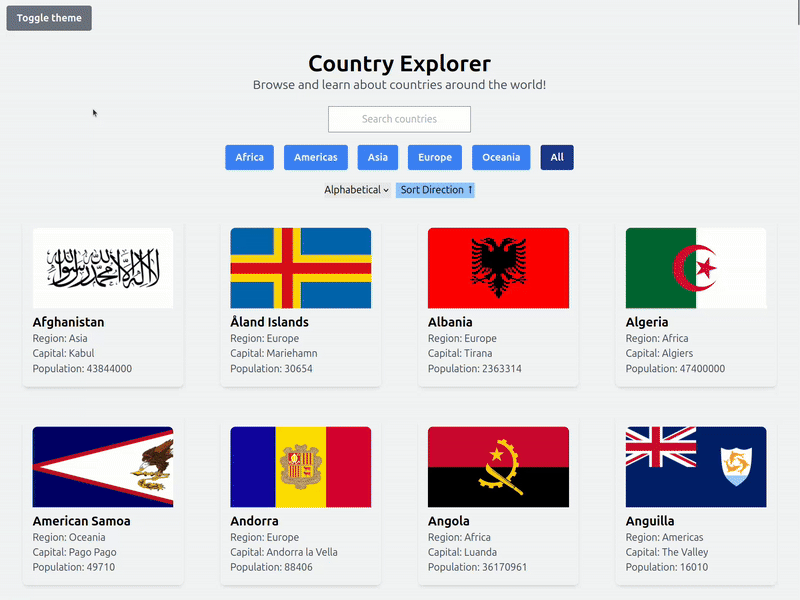

# 🌍 Country Explorer

A React application that lets users explore countries around the world using real data from the REST Countries API.  

---

## ✨ Features

- 🔍 **Search countries** by name
- 🌎 **Filter by region** (Africa, Americas, Asia, Europe, Oceania, All)
- 🔃 **Sort countries** by:
  - Alphabetical order
  - Capital
  - Population (ascending / descending)
- 🌓 **Light & Dark mode** with a toggle
- 📄 **Detailed country modal** with:
  - Flag
  - Capital
  - Population
  - Area
  - Languages
  - Currencies
- 🗺️ **Interactive map** using Leaflet:
  - Centers on the selected country
  - Displays country borders using GeoJSON
  - Fullscreen map support

---

## 🛠️ Tech Stack

- **React** (Vite)
- **Tailwind CSS**
- **REST Countries API**
- **React Leaflet / Leaflet**
- **GeoJSON** (Natural Earth data)

---

## 📚 What I Learned

This project helped me practice and understand:

- Component-based architecture in React
- Passing data via props vs lifting state
- Filtering, sorting, and searching derived state
- Conditional rendering and modals
- Dark mode handling with Tailwind
- Working with external APIs and nested data
- Integrating maps and GeoJSON data
- Refactoring a large `App.jsx` into reusable components

---

## 🚀 Getting Started

```bash
npm install
npm run dev

---

## Preview

### Country Grid
# 

### Filters & Search
# 

### Country Details Modal
# 

### Interactive Map
# 

### Dark Mode

